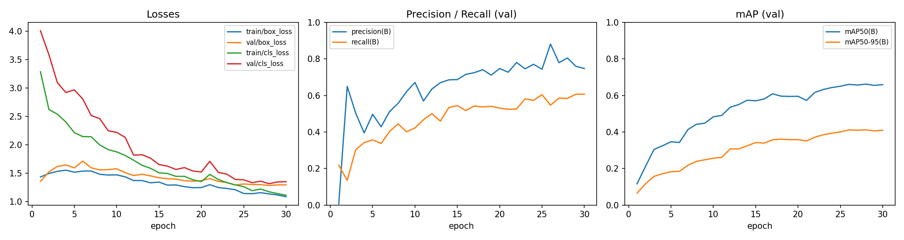

# PPE compliance detection on construction sites — YOLOv8

**MAICEN-0526 · Module 4, Unit 3 (Computer Vision) · Zigurat Institute of Technology**

**Group 7:** Rama Abu Ghoush · Chloe C. · Vijay Arun Dongre · Margarita Hondele · Solomon Yirga

| Notebook | Purpose | Credentials needed | Open |
|---|---|---|---|
| `01_baseline_inference.ipynb` | Generic COCO model vs our fine-tuned PPE model on unseen site photos | **None** | [](https://colab.research.google.com/github/solomon8909/maicen0526-m4u3-ppe-detection/blob/main/notebooks/01_baseline_inference.ipynb) |
| `02_train_eval.ipynb` | Full pipeline: dataset → training → metrics → curves → evidence → error mining | **None** | [](https://colab.research.google.com/github/solomon8909/maicen0526-m4u3-ppe-detection/blob/main/notebooks/02_train_eval.ipynb) |

Neither notebook needs a Roboflow account, an API key or a Colab secret. Open from the badge, `Runtime → Disconnect and delete runtime`, then `Run all`.

**Release v1.0** (dataset, unseen images, weights): [assets](https://github.com/solomon8909/maicen0526-m4u3-ppe-detection/releases/tag/v1.0) · **PDF pack:** [slides](docs/pdf/MAICEN_0526_M4U3_G7_Slides.pdf) · [mini report](docs/pdf/MAICEN_0526_M4U3_G7_Mini_Report.pdf)

---

## 1. The problem

On an active industrial build such as the DDIP grain processing facility in Djibouti (AHG portfolio, project FAIT-DDIP-GSF), PPE compliance is checked by walking the site. A safety officer sees one area at a time, and the record of what was seen is a paper form. The question this project asks is narrow: **can a small detector, trained on public data, reliably flag a worker who is missing a hardhat or a hi-vis vest in a site photo?**

It is a decision-support aid for the safety officer, not a replacement. The system flags; a person decides.

**Success criteria** (set before training, judged on the validation split):

| Criterion | Target | Why |
|---|---|---|
| Recall on `NO-Hardhat` | ≥ 0.70 | A missed violation is the costly error (see [risk note](docs/governance_checklist.md#4-risk-note--false-negatives-vs-false-positives)) |
| Overall mAP50 | ≥ 0.60 | Reasonable for a 30-epoch nano model on 574 training images |
| Runs cloud-only, no credentials | Colab, from this repo | Brief requirement; also how an AHG site team would trial it |

## 2. Classes and label rules

Five classes. Full definitions with edge cases are in [`docs/class_definitions.md`](docs/class_definitions.md).

| Class | Box covers | Rule in one line |
|---|---|---|
| `Hardhat` | The helmet only | A rigid safety helmet being worn on the head |
| `NO-Hardhat` | The head | A visible head with no safety helmet (caps and hoods count as NO-Hardhat) |
| `Safety Vest` | The vest on the torso | High-visibility vest or jacket being worn |
| `NO-Safety Vest` | The torso | A visible torso with no high-visibility garment |
| `Person` | Whole visible body | Every person, regardless of PPE |

## 3. Dataset

| | |
|---|---|
| **Upstream source** | [Construction Site Safety — Roboflow Universe](https://universe.roboflow.com/roboflow-universe-projects/construction-site-safety), by Roboflow Universe Projects |
| **Our Roboflow project and version** | `solomon-yirga / construction-site-safety-cnfob`, **version 1** (`v1-ppe-5class-80-20`) — annotation and versioning only; not on the reproduction path |
| **Frozen release asset** | [`ppe-construction-v1-yolo11.zip`](https://github.com/solomon8909/maicen0526-m4u3-ppe-detection/releases/download/v1.0/ppe-construction-v1-yolo11.zip) |
| **SHA256** | `979ebedaa790feb32be28f93d96dc034ac0f71bbdfaeb589746cc61d8b83c926` |
| **Export format** | YOLOv11 (identical label format to YOLOv8; trained with a YOLOv8 model per the brief) |
| **Licence** | **CC BY 4.0** — same licence as upstream, attribution below |

**Splits and labelled instances per class**

| split | images | Hardhat | NO-Hardhat | NO-Safety Vest | Person | Safety Vest |
|---|---|---|---|---|---|---|
| train | 574 | 454 | 315 | 424 | 910 | 375 |
| valid | 143 | 120 | 87 | 158 | 238 | 49 |

Source project: 717 images, 25 classes. The classes are unevenly represented: `Person` carries roughly twice the instances of any PPE class, and `Safety Vest` has only 49 instances in validation, so its per-class metrics rest on a thin sample and should be read with that in mind.

**Version settings:** 80 / 20 train / valid (rebalanced at version generation, 0% test) · **preprocessing:** resize (stretch) to 640 × 640 · **augmentation:** none · **classes:** five of the upstream 25 retained; the other 20 (Mask, NO-Mask, Safety Cone, Gloves, Ladder, Excavator, machinery and the vehicle classes) omitted via Modify Classes.

**Unseen images** for inference evidence: [`new-images.zip`](https://github.com/solomon8909/maicen0526-m4u3-ppe-detection/releases/download/v1.0/new-images.zip), SHA256 `5d3597fc72a5e0d2b38a7eeaa969aa80ad6c13df59ad543d9bb93404b1958dde` — five Wikimedia Commons photographs (CC BY 4.0, CC BY-SA 3.0, CC0 ×2, CC BY-SA 2.0), chosen to span a baseline case, distant figures, missing PPE, a back-lit silhouette and a close-up. Sources and licences are listed in [`docs/new_images_sources.md`](docs/new_images_sources.md). These images are in neither the training nor the validation split.

> No dataset zip and no images are committed to this repository. They live in the Release, which is where the checksums point.

## 4. How to reproduce (Colab only, no credentials)

**Quick check (~3 min):** open `01_baseline_inference.ipynb` with the badge above → `Runtime → Disconnect and delete runtime` → `Run all`. It downloads the released weights and unseen images, verifies their checksums, and shows the generic COCO model beside ours.

**Full pipeline:**

1. Click the `02_train_eval.ipynb` badge. Colab opens it straight from GitHub.
2. `Runtime → Change runtime type → T4 GPU → Save`.
3. `Runtime → Disconnect and delete runtime`, then `Run all`. Nothing else to configure.
4. Choose a different `RUN_MODE` in the configuration cell for a shorter run:
   - `"full"` — trains 30 epochs, evaluates the new weights (~6 min on T4 for this dataset)
   - `"verify"` — 5-epoch verification run, then evaluates our released weights (~3–5 min)
   - `"load"` — no training; evaluates the released weights (~2–3 min)

**Expected outputs, in order:** the dataset download reporting `SHA256 verified: …`, the split and class-count table, training logs, the metrics table (precision, recall, mAP50, mAP50–95, overall and per class), training curves, confusion matrix and PR curve, the evidence images listed below, false-positive and false-negative counts, and the reproducibility record. The last cell downloads everything as `results.zip`.

If Colab gives you no GPU, the notebook switches `full` to `verify` by itself and records that it did.

## 5. Results

**Validation split · 143 images · confidence 0.25 · IoU 0.50**

| class | precision | recall | mAP50 | mAP50-95 |
|---|---|---|---|---|
| all | 0.806 | 0.584 | 0.662 | 0.411 |
| Hardhat | 0.952 | 0.633 | 0.760 | 0.486 |
| NO-Hardhat | 0.700 | 0.510 | 0.545 | 0.291 |
| NO-Safety Vest | 0.767 | 0.499 | 0.573 | 0.338 |
| Person | 0.832 | 0.626 | 0.716 | 0.485 |
| Safety Vest | 0.779 | 0.653 | 0.717 | 0.456 |



**What the numbers say**

**One target met, one missed.** Overall mAP50 of 0.662 clears the 0.60 we set. Recall on `NO-Hardhat` is 0.510, well short of the 0.70 we said we needed. We are reporting that as a failure against our own criterion rather than adjusting the criterion after the fact.

**The model is cautious, and it is cautious in the wrong direction for this use.** Precision exceeds recall on every one of the five classes — 0.806 against 0.584 overall. When it flags something it is usually right; `Hardhat` precision reaches 0.952 against just 5 false positives. But across the validation split it produced 216 false negatives against 128 false positives, so it misses far more than it invents. `Hardhat` alone accounts for 60 misses.

**The two classes that carry the safety signal are the weakest.** `NO-Hardhat` and `NO-Safety Vest` come last on every measure (mAP50 0.545 and 0.573, recall 0.510 and 0.499). This is exactly the failure mode the [risk note](docs/governance_checklist.md#4-risk-note--false-negatives-vs-false-positives) anticipated before we had any numbers: a missed violation is the error that matters, and this model's bias runs against its own purpose. Detecting an absence is harder than detecting an object, and the results show the cost of that.

**Two caveats on the per-class figures.** `Safety Vest` scores well (mAP50 0.717) on only 49 validation instances, a thin enough sample that the number should not be leaned on. And the most confident false positives are `NO-Hardhat` predictions at 0.85–0.95 — so where the model does invent violations, it does so with conviction.

**What follows for deployment.** As it stands this is a screening aid at a lowered confidence threshold, not a compliance check. Raising recall on the negative classes is the first priority, and the error analysis sets out which data would do it.

**Evidence** — everything is in [`results/`](results/):

| Folder | Contents |
|---|---|
| [`results/curves/`](results/curves/) | Training curves, PR / F1 curves, confusion matrices |
| [`results/evidence/annotation_examples/`](results/evidence/annotation_examples/) | 5 labelled training images |
| [`results/evidence/validation_predictions/`](results/evidence/validation_predictions/) | 10 validation images — ground truth beside prediction |
| [`results/evidence/new_image_predictions/`](results/evidence/new_image_predictions/) | 5 unseen images |
| [`results/evidence/false_positives/`](results/evidence/false_positives/) · [`false_negatives/`](results/evidence/false_negatives/) | Worst errors, used in the error analysis |

Error analysis: [`docs/error_analysis.md`](docs/error_analysis.md) · Governance: [`docs/governance_checklist.md`](docs/governance_checklist.md)

## 6. Reproducibility checklist

- [x] **Data path:** keyless HTTPS download from the GitHub Release, SHA256-verified in the notebook. No account, no API key, no Colab secret.
- [x] **Dataset:** `ppe-construction-v1-yolo11.zip` · SHA256 `979ebedaa790feb32be28f93d96dc034ac0f71bbdfaeb589746cc61d8b83c926` · frozen, never regenerated
- [x] **Annotation source:** Roboflow `solomon-yirga/construction-site-safety-cnfob` **version 1** (pinned; secondary path only)
- [x] **Split:** 80 / 20 train / valid
- [x] **Model variant:** `yolov8n.pt` (COCO-pretrained starting weights)
- [x] **Epochs / batch / imgsz:** 30 / 16 / 640 · seed 42 · `deterministic=True`
- [x] **Ultralytics version:** 8.4.163 · torch 2.11.0+cu128 · Python 3.13.15
- [x] **Weights:** Release `v1.0` → `best.pt`
- [x] **Confidence / IoU for evidence and error mining:** 0.25 / 0.50
- [x] **No credentials anywhere** in committed cells, cell outputs or git history

### Reproducibility proof

- **Last successful run:** 2026-09-25 20:59 UTC
- **Run mode:** `full`
- **Hardware:** Tesla T4
- **Software:** Python 3.13.15 · torch 2.11.0+cu128 · ultralytics 8.4.163
- **Dataset:** frozen release asset `ppe-construction-v1-yolo11.zip` · SHA256 `979ebedaa790feb32be28f93d96dc034ac0f71bbdfaeb589746cc61d8b83c926` · train 574 / val 143 images
- **Data path used:** keyless GitHub Release (no credentials) · annotated and versioned in Roboflow `solomon-yirga/construction-site-safety-cnfob` v1
- **Model / parameters:** yolov8n.pt · epochs 30 · batch 16 · imgsz 640 · seed 42
- **Training time:** 5.4 min · **Total notebook runtime:** 5.7 min
- **Expected runtime:** full ≈ 6–10 min on T4 · verify ≈ 3–5 min · load ≈ 2–3 min

The full record, including the metrics table, is in [`results/reproducibility_record.md`](results/reproducibility_record.md).

## 7. Repository structure

```
├── README.md
├── LICENSE                      MIT — our code and documentation
├── requirements.txt
├── notebooks/
│   ├── 01_baseline_inference.ipynb    no credentials, ~3 min
│   └── 02_train_eval.ipynb            no credentials, full pipeline
├── docs/
│   ├── class_definitions.md
│   ├── error_analysis.md
│   ├── governance_checklist.md
│   ├── new_images_sources.md
│   └── pdf/                     slides + mini report
└── results/
    ├── curves/  metrics/
    └── evidence/                annotation_examples · validation_predictions · new_image_predictions
                                 false_positives · false_negatives
```

Dataset, unseen images and weights are Release assets, not repository files.

## 8. Licence and data rights

- **Our code and documentation:** MIT ([`LICENSE`](LICENSE)).
- **Dataset:** Construction Site Safety by Roboflow Universe Projects, **CC BY 4.0**. Republishing the frozen zip as a Release asset is redistribution, which CC BY 4.0 permits with attribution; the released asset therefore carries the same licence as upstream. We do not own this data.
- **Unseen images:** each one's source, author and licence is listed in [`docs/new_images_sources.md`](docs/new_images_sources.md). No client or AHG project photographs are published here. Two of the five are share-alike (CC BY-SA 3.0 and CC BY-SA 2.0), so the prediction overlays derived from them in `results/evidence/new_image_predictions/` are shared under those same licences, with attribution.
- **Model weights and training library:** trained with [Ultralytics YOLOv8](https://github.com/ultralytics/ultralytics), which is **AGPL-3.0**. The released `best.pt` is shared for academic reproduction only. Any commercial deployment would need AGPL-3.0 compliance or an Ultralytics Enterprise licence — see the [governance checklist](docs/governance_checklist.md#6-licensing-and-data-rights).

## 9. Team and contributions

| Member | Contribution |
|---|---|
| Rama Abu Ghoush | Dataset quality review against the label rules; annotation screenshots; label-error log feeding the error analysis |
| Chloe C. | Unseen-image pack: sourcing, licence and attribution record, privacy screening |
| Vijay Arun Dongre | Error analysis: false-positive and false-negative review, failure hypotheses, data-improvement plan |
| Margarita Hondele | Slides and mini report; governance checklist review |
| Solomon Yirga | Dataset version and frozen release, notebooks, training run, repository and README, reproducibility proof, submission |

⟪FILL: adjust this table to what each person actually delivered before submitting — it should be accurate, not aspirational.⟫

## 10. AI use declaration

Generative AI (Anthropic Claude) was used to help structure the repository, draft notebook code and documentation, and review the brief against the rubric. All training runs, results, error interpretation and final wording were produced and checked by the group.

## Citation

```bibtex
@misc{construction-site-safety_dataset,
  title        = {Construction Site Safety Dataset},
  author       = {Roboflow Universe Projects},
  howpublished = {\url{https://universe.roboflow.com/roboflow-universe-projects/construction-site-safety}},
  publisher    = {Roboflow Universe},
  note         = {CC BY 4.0}
}
```

