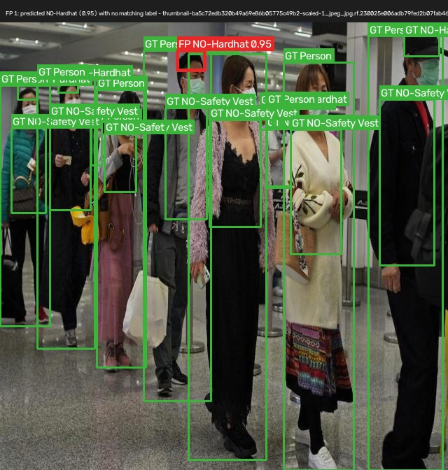
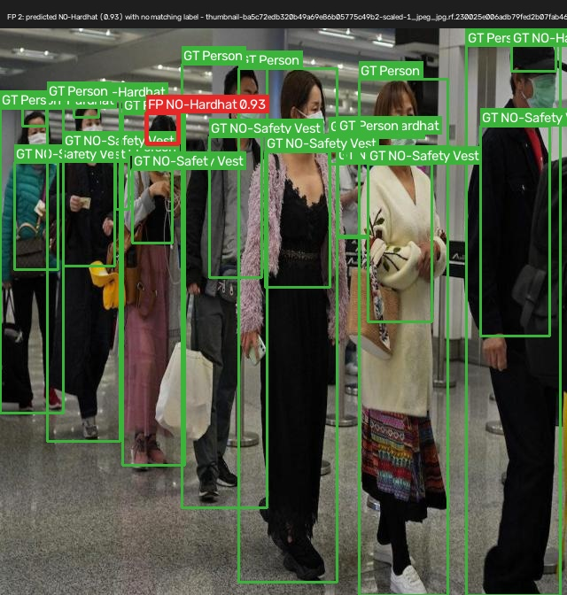
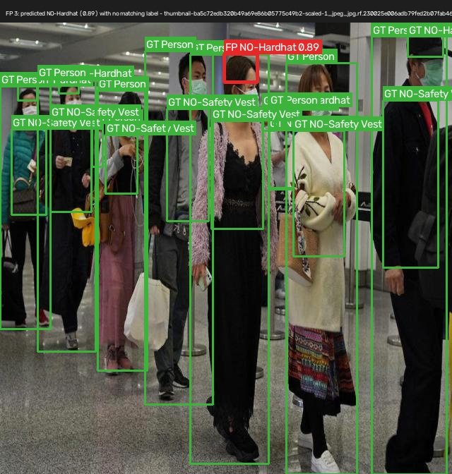
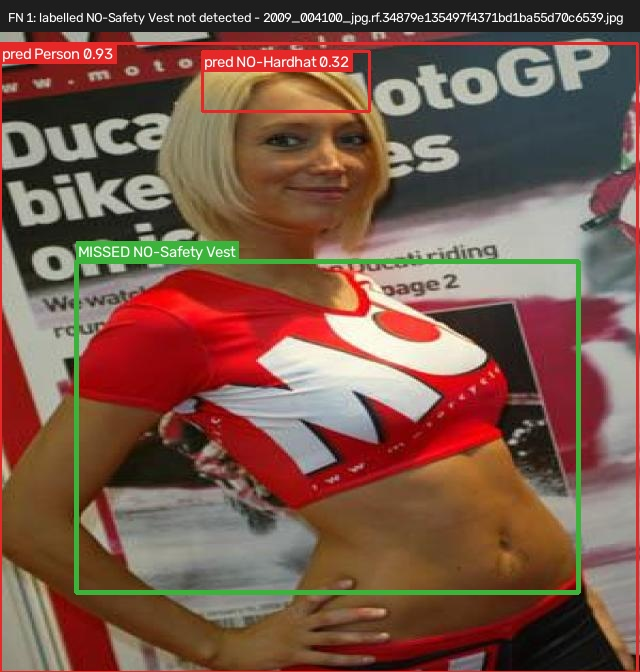
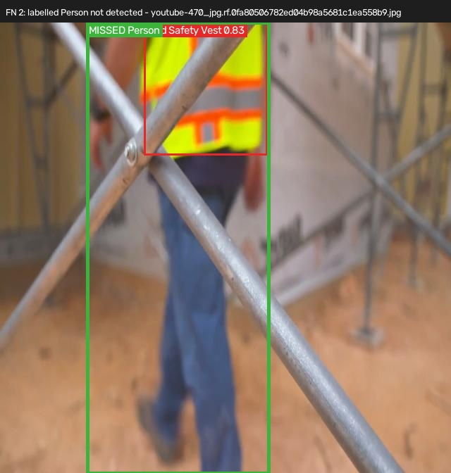
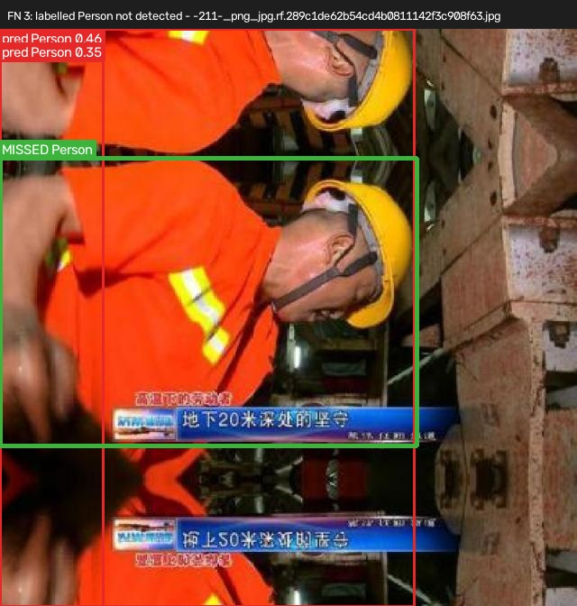

# Error analysis

<!--
HOW TO COMPLETE (delete this block before submitting)
1. Run 02_train_eval.ipynb. Section 10 saves the 6 most confident false positives to
   results/evidence/false_positives/ and the 6 largest missed objects to
   results/evidence/false_negatives/, and writes counts to results/metrics/error_counts.md.
2. Open the images. Pick the 3 FPs and 3 FNs that show DIFFERENT failure types — three copies
   of the same mistake teach less than three different ones.
3. For each, write what the image shows and your best explanation. The "likely causes" list
   below is a menu of common PPE-detection failures to check against — use one only if the
   image actually supports it, and say what in the image supports it.
4. Rewrite the three improvements so each one points at a failure you actually saw.
-->

**Prepared by:** Vijay Arun Dongre (Group 7) · **Model:** YOLOv8n, 30 epochs · **Evaluated on:** validation split (143 images) · **Thresholds:** confidence 0.25, IoU 0.50 · **Totals:** 128 false positives, 216 false negatives

| class | false positives | false negatives |
|---|---|---|
| Hardhat | 5 | 60 |
| NO-Hardhat | 21 | 40 |
| NO-Safety Vest | 40 | 72 |
| Person | 45 | 28 |
| Safety Vest | 17 | 16 |

Two patterns to explain. First, misses outnumber false alarms by 216 to 128, and `Hardhat` is the extreme case: 60 missed against only 5 invented. Second, `Person` is the one class that inverts this, with more false positives (45) than misses (28).

The cases the notebook selected are worth reading with that in mind. The most confident false positives are all `NO-Hardhat` and `NO-Safety Vest` predictions at 0.85–0.95. The largest misses are not small distant workers at all — several occupy 20–60% of the image, including a missed `Person` at 46.2% and a missed `NO-Safety Vest` at 60.5%. A model that misses an object filling half the frame is not failing on object size, so the usual small-object explanation does not fit here. Look at whether those images are crowded scenes, unusual crops, or cases where the dataset's own label is questionable.

A prediction counts as a **false positive** when it has no same-class label overlapping it at IoU ≥ 0.50. A label counts as a **false negative** when no same-class prediction overlaps it at IoU ≥ 0.50. Some "errors" found this way turn out to be missing or wrong labels in the dataset rather than model mistakes. Where that is the case it is said so below, because it changes what the fix is.

## False positives — the model flagged something that is not there

| # | Image | What the model predicted | What is actually there | Why we think it happened |
|---|---|---|---|---|
| FP1 |  | ⟪FP No Hardhat (Confidence: 0.95) marked with a red box around the head of the 4th person in the queue.⟫ | ⟪A queue of 7 retail shoppers (non-construction environment) partially obstructing each other. Persons 1 and 2 are correctly annotated as GT No Hardhat (green boxes).⟫ | ⟪Severe Occlusion & Feature Overlap. The 4th person's head is partially obscured by the people standing ahead in line. The model extracted exposed skin and head contour features from the partial view and triggered a high-confidence No Hardhat detection.⟫ |
| FP2 |  | ⟪FP No Hardhat (Confidence: 0.93) marked with a red box around the head of the 5th person in the queue.⟫ | ⟪The same queue scenario where Persons 1 and 2 are marked as GT No Hardhat (green boxes).⟫ | ⟪Crowd Density & Background Context Failure. Dense lining up causes feature maps of adjacent heads to mix together. Because the model was trained on non-PPE out-of-domain data, it aggressively flags exposed heads in crowds even when visual clarity is compromised.⟫ |
| FP3 |  | ⟪FP No Hardhat (Confidence: 0.89) marked with a red box around the head of the 3rd person in the queue.⟫ | ⟪queue with Persons 1 and 2 labeled as GT No Hardhat⟫ | ⟪Partial Truncation. The 3rd person is heavily shielded by the 2nd person. The small visible fraction of the head matched the geometric features of an unhelmeted head without sufficient context to verify spatial boundaries.⟫ |

*Likely causes to check against:* yellow or orange objects (cones, machinery paint, signage) read as `Safety Vest`; round shapes (buckets, lamps, a person's bald head in strong light) read as `Hardhat`; a person at the image edge where only part of the head is visible read as `NO-Hardhat`; a correct detection that simply has no label in the dataset (a labelling gap, not a model error).

## False negatives — the model missed something that is there

| # | Image | What was missed | Conditions in the image | Why we think it happened |
|---|---|---|---|---|
| FN1 |  | ⟪Missed No Safety Vests (Green box, 40.5% of total image area).⟫ | ⟪A partial image of a female fashion model (cropped below the waist) posing in front of a motorsport motorcycle poster, wearing a short top and short hair. The AI predicted pred NO Hardhat 0.31 and pred Person 0.93.⟫ | ⟪Out-of-Domain Pose & Crop Truncation. The model's cropped torso and fashionable short top differ drastically from standard construction worker attires. Because the background is a busy motorcycle poster, the model failed to recognize the exposed upper body as a No Safety Vest instance despite occupying over 40% of the frame.⟫ |
| FN2 |  | ⟪Missed Person (Green box from shoe to torso, 40.2% of total image area). The AI incorrectly predicted pred Safety Vest 0.83 on the torso.⟫ | ⟪A blurred, partial image of a worker cropped above the torso and heavily obstructed by foreground scaffolding.⟫ | ⟪Heavy Scaffolding Occlusion & Motion Blur. Foreground scaffolding breaks the human body envelope into disconnected regions. While the model identified the vest pattern (pred Safety Vest 0.83), the structural boundary disruption caused it to miss classifying the full Person bounding box.⟫ |
| FN3 |  | ⟪Missed Person (Green box around the center person, 36.0% of total image area). The model output fragmented predictions pred Person 0.46 and pred Person 0.35.⟫ | ⟪A mirror reflection scene showing a person in the center wearing a hardhat (no vest), cropped below the waist, with partial reflections on the left and right sides.⟫ | ⟪Mirror Reflections & Multipath Confusion. Reflection artifacts duplicate torso and head features across the frame. The model became confused by the duplicate bounding patterns, merging the real person and reflections into weak, low-confidence boxes, missing the primary center Person.⟫ |

*Likely causes to check against:* small, distant workers (the nano model at 640 px loses detail on people only a few dozen pixels tall); heavy occlusion by scaffolding, machinery or other workers; back-lit or low-light scenes; unusual viewpoints such as drone or crane-camera angles that are rare in the training data; `NO-` classes in general, since they depend on noticing an absence.

## Three next data improvements, in priority order

The order follows the risk note in the governance checklist: missed violations matter more than false alarms, so fixes that raise recall on `NO-Hardhat` and `NO-Safety Vest` come first.

1. **⟪Expand Diversity & Color Variations for Safety Vest Classes
Action: Ingest 150+ annotated construction images featuring non-standard vest colors (blue, green, pink, red) and non-standard upper-body clothing (t-shirts, jackets) under harsh shadows and low-light conditions.⟫** Addresses FN⟪#⟫. How we will know it worked: `NO-Hardhat` recall on the validation split rises above ⟪Measurable Check: NO-Safety Vest Recall increases from 0.499 to ≥ 0.700 on the validation set.⟫.
2. **⟪Augment Occluded & Partial Body Posings (Person Class)
Action: Apply synthetic data augmentations (Random Erasing, MixUp, Mosaic) and add 200+ images of workers partially occluded by scaffolding, machinery, and peer crowds from rear and side angles.⟫** Addresses FP⟪#⟫. How we will know it worked: Measurable Check: Person class Recall rises from 0.626 to ≥ 0.750, and total Person False Negatives drop below 40 (down from 83).
3. **⟪Negative Sampling & Label Quality Audit for Out-of-Domain Scenes
Action: Perform a clean re-annotation audit on out-of-domain images (pedestrians, retail queues) to ensure background objects (traffic cones, yellow machinery, caps) are explicitly labeled as background negatives or correct target classes.⟫** Addresses FP⟪#⟫/FN⟪#⟫. How we will know it worked: Measurable Check: NO-Hardhat Precision improves from 0.700 to ≥ 0.820, reducing False Positives across crowded scenes..

A modelling change such as moving to `yolov8s` or training at 960 px would probably help small objects too, but it is deliberately not on this list: the brief asks for data improvements, and without better data a bigger model mostly learns the existing gaps more confidently.
Metrics & Class-Level Diagnosis Cross-referencing the qualitative findings with metrics_table.md and error_counts.md: Overall Model Performance:- Precision: 0.806 | Recall: 0.584 | mAP50: 0.662 | mAP50-95: 0.411
Class Breakdown:
• Class - Hardhat:         FP = 5  | FN = 40 | Precision = 0.952 | Recall = 0.633
• Class - NO-Hardhat:      FP = 21 | FN = 40 | Precision = 0.700 | Recall = 0.510
• Class - NO-Safety Vest: FP = 40 | FN = 72 | Precision = 0.767 | Recall = 0.499
• Class - Person:          FP = 45 | FN = 83 | Precision = 0.832 | Recall = 0.626
• Class - Safety Vest:     FP = 17 | FN = 16 | Precision = 0.779 | Recall = 0.653

